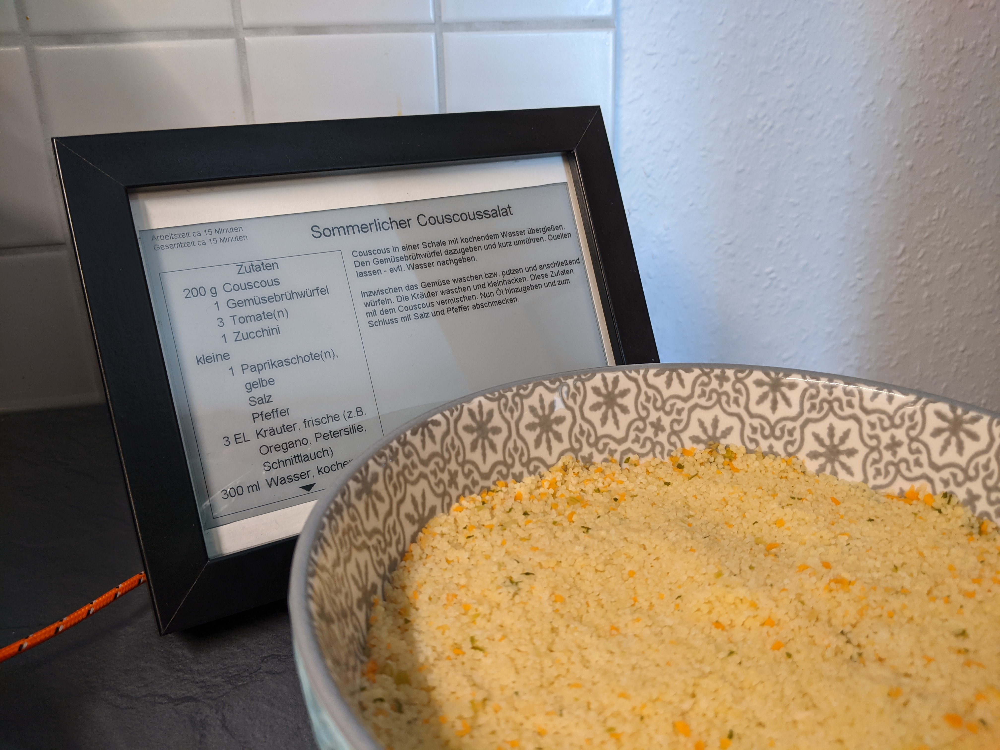
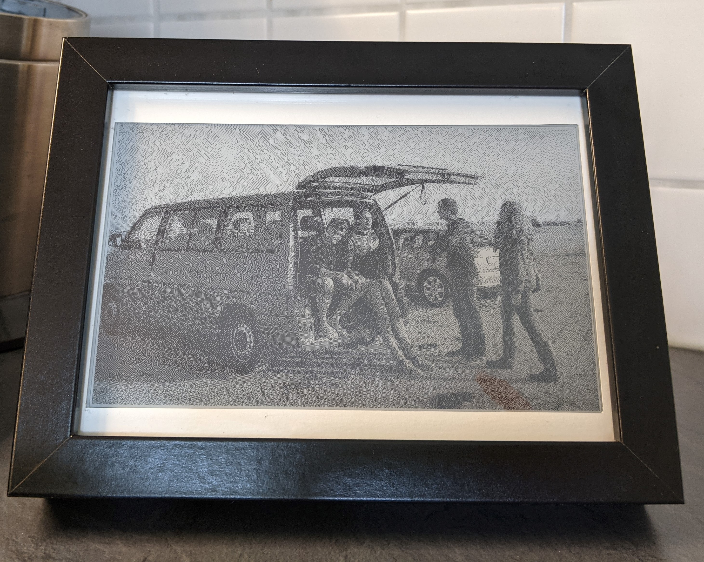
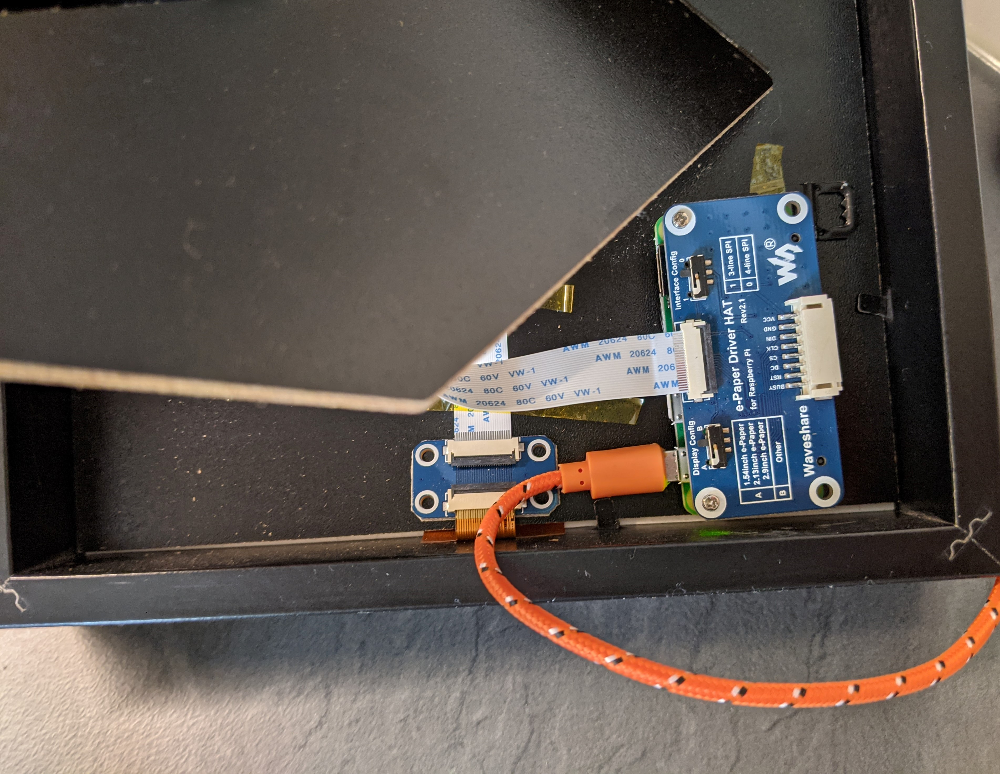

# KitchenDisplay

## Einleitung
Selbst gekochtes Essen schmeckt nicht nur besser, sondern ist oft auch gesünder und verzichtet auf Zusatzstoffe. Doch wo kommen die ganzen Rezepte her?  
Wenn man was Neues ausprobieren will, ist meist ChefK**€# die erste Anlaufstelle. Doch ein Tablet in der Küche ist mit dreckigen Händen oft keine gute Idee. Auch sind solche Webseiten oft voll mit Werbung, was für die Finanzierung legitim ist, beim tatsächlichen Nachkochen der Rezepte kann das ständige Scrollen jedoch schnell nervig werden.  
Deshalb hab ich mir ein Display gebaut, was den Komfort von online Rezepten, das angenehme Leseverhalten von Papier und eine Hands free Experience* kombiniert.  
*Sprachsteuerung ist im ersten Prototyp noch nicht enthalten. 

## Funktionen
* Rezept anzeigen
* Foto anzeigen

## Rezept anzeigen
1.	Verknüpfe die App mit deinem Display (siehe Einrichtung der App)
2.	Geh mit deinem Handy oder Tablet auf die online Rezepte Seite deines Vertrauens. 
3.	Suche dir ein Rezept raus, was du gerne nachkochen möchtest.
4.	Wähle in deinem Browser die Funktion „Teilen mit“ aus.
5.	Wähle nun die Kochbuch App aus.
6.	Das Rezept ist nun auf deinem Display sichtbar.

## Aktuell unterstützte Plattformen
*	ChefK*€#
*	Weitere folgen

## Hardware
*	Display: 7.5inch HD e-Paper E-Ink Display HAT for Raspberry Pi, 880×528, Black / White, SPI (https://www.waveshare.com/product/7.5inch-hd-e-paper-hat.htm)
*	Controller: Raspberry Pi Zero W (https://www.raspberrypi.org/products/raspberry-pi-zero-w/)
*	Bilderrahmen: RIBBA Rahmen, schwarz13x18 cm (https://www.ikea.com/de/de/p/ribba-rahmen-schwarz-50378448/)

## Einrichtung
1.	Raspberry Pi einrichten. Es wird keine GUI benötigt, ich verwende Raspberry Pi OS Lite. 
Der Pi lässt sich auch über SSH einrichten. (https://www.raspberrypi.org/documentation/configuration/wireless/headless.md)
2.	Display an den Pi anschließen und einrichten.
      1. `sudo raspi-config`
      2. Interfacing Options (5)
      3. SPI aktivieren 
      4. Pi neu starten: `sudo reboot`
      4. Weitere Informationen finden sich im  Waveshare Wiki. (https://www.waveshare.com/wiki/7.5inch_HD_e-Paper_HAT#Hardware_connection)
3.	Das Projekt auf den Pi klonen: `git clone https://github.com/Titti91/KitchenDisplay.git` 
4.	Abhängigkeiten installieren 
      1.    BCM2835 Bibliotheken installieren  
                `wget http://www.airspayce.com/mikem/bcm2835/bcm2835-1.60.tar.gz`  
                `tar zxvf bcm2835-1.60.tar.gz`  
                `cd bcm2835-1.60/`  
                `sudo ./configure`  
                `sudo make`  
                `sudo make check`  
                `sudo make install`
      2.    WiringPi installiern  
            `sudo apt-get install wiringpi`  
            `wget https://project-downloads.drogon.net/wiringpi-latest.deb`  
            `sudo dpkg -i wiringpi-latest.deb`  
            `gpio -v`  
      3.    Python 3 installieren  
            `sudo apt-get update`  
            `sudo apt-get install python3-pip`  
            `sudo apt-get install python3-pil`  
            `sudo apt-get install python3-numpy`  
            `sudo pip3 install RPi.GPIO`  
            `sudo pip3 install spidev`  
      4.    PIL Bibliothek installieren   
            `sudo apt-get install python3-pil `
      5.    Beautifulsoup installieren  
            `pip3 install beautifulsoup4`  
            `pip3 install requests`

5.	Für die Verwendung von Bildern müssen diese als Bitmap in den Ordner `pic` gelegt werden. Die Bilder sollten eine Auflösung von 880x528 Pixeln haben und sollten keinen Leerzeichen im Dateinamen haben. 
6.	Das Projekt verwendet eine andere Schriftart, als die im Standard enthaltene Schriftart. Die Schriftart Arial muss als ttf Datei in den `font` Ordner gelegt werden. Die arial.ttf Datei findet sich unter Windows in den Schriftarteinstellungen und kann kopiert werden (C:windows\fonts\arial.ttf). 
7.	CronTab für das automatische Starten des Servers anlegen:
       1.   `crontab -e`  
       2.   Folgende Zeile an die eigenen Bedürfnisse und Gegebenheiten anpassen, einfügen und speichern: `@reboot /usr/bin/python3 /home/pi/KitchenDisplay/src/Server.py >> ~/cron.log 2>&1`
8.	Den Pi neu starten um den Server starten 
        1.  `sudo reboot`
        2.  Standardport: `8080`
 

## Bildermodus
Das Display kann beliebige Bilder anzeigen. Dazu muss das Bild schwarz weiß sein und als Bitmat in einer Auflösung von 880×528 im Ordner `pic` abgelegt werden.
Bei Verwendung der Funktion wird per Zufall eins der Bilder angezeigt, die sich in dem Ordner befinden. 

## API
Die Kommunikation zwischen Eingabegerät (App) und Display erfolgt über eine REST API. Somit lassen sich auch andere Geräte für die Steuerung verwenden. 
Endpunkte:
*	Neues Rezept laden
    *	`/new/recipe` (post)
    *	Body: `{"url" : "https://url_zum_Rezept.html"}`
*	Rezept blättern
    *	`/recipe/page` (post)
    *	Body: `{"direction": "++"}` // ++ für vorwärts; -- für rückwärts
*	Zutaten blättern
    *	`/ingredient/page` (post)
    *	Body: `{"direction": "++"}` // ++ für vorwärts; -- für rückwärts
*	Bilder anzeigen
    *	`/screensaver` (post)

## Nützliche Links:
*	Waveshare Wiki: https://www.waveshare.com/wiki/7.5inch_HD_e-Paper_HAT 
*	Raspberri Pi Headless setup: https://www.raspberrypi.org/documentation/configuration/wireless/headless.md 
*	Fotobearbeitungssoftware: https://www.photopea.com/ 

